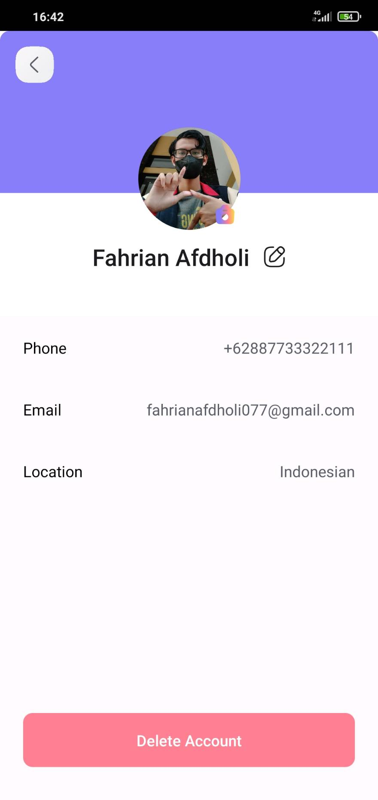

# WallpaperCollectApp

## Overview

This is app for collecting wallpaper, you can add and download wallpaper in this app. you can also make a favorite some wallpaper.
Before you use this app you should register your account with google account or with email @wallpaper.Collect.app. if you already register your account you can login in login screen.
i use https://github.com/fchrgrib/wallpaperCollectAPI API to build this app.

## Framework Use
```
-Hilt Dagger
-Jepack Compose
-Retrofit
-Moshi
```

## Screen

### Splash Screen


### Welcome Screen


### Register Screen


### Login Screen


### Home Screen


### Navigation Drawer


### Profile Screen


### Author's Contact Screen


### Privacy Policy Screen


### Download Screen


## Author
```
Fahrian Afdholi
fahrianafdholi077@gmail.com
https://twitter.com/fadholi23
```
